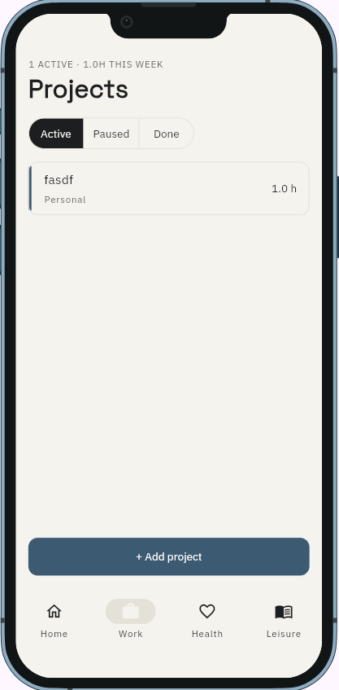
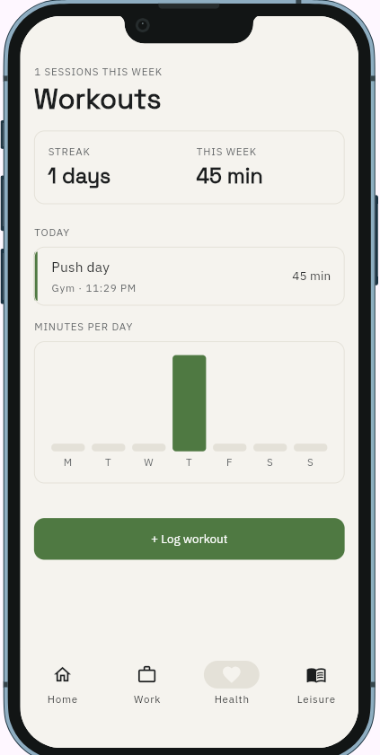
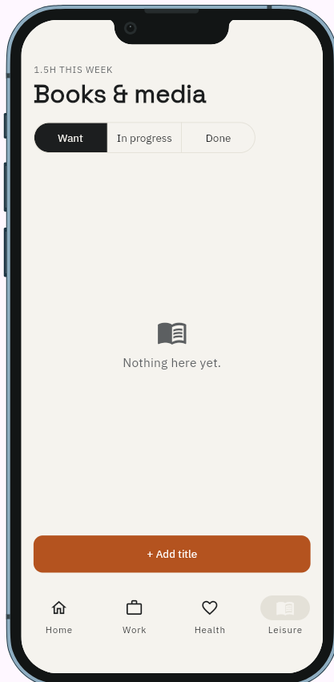
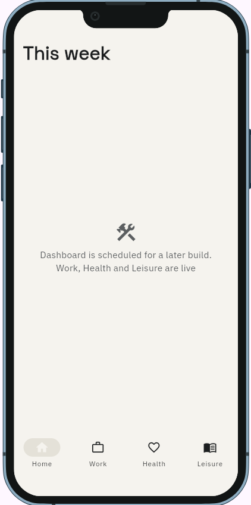

<<<<<<< HEAD
# Trivet

## 1. Overview

Trivet is a weekly balance tracker for university students and
early-career workers whose week isn't fixed by an employer, timetable, or
parent. It shows how many hours went into Work, Health, and Leisure this
week, side by side, so a person can see when one pillar is crowding out
the others — without a made-up "balance score" behind it.

## 2. Setup and installation

- Built against Flutter's stable channel, Dart SDK `>=3.3.0 <4.0.0` (see
  `pubspec.yaml`).
- Clone the repository, then from the project root:

  ```
  flutter pub get
  ```

- No configuration needed. Trivet is fully offline and single-user —
  there's no backend URL, no API key, and nothing to place in an `.env`
  file. All data is stored locally on the device with `shared_preferences`.

## 3. How to run it

```
flutter run -d chrome
```

(or `flutter run` targeting a connected device/simulator). On launch you
should see a bottom navigation bar with four tabs — **Home**, **Work**,
**Health**, **Leisure** — and Design System v2's Paper/Ink colour scheme
(light by default, following the system theme). Home currently shows a
placeholder; Work, Health, and Leisure are live and start with empty
lists.

## 4. Features and usage

**Work** — Filter projects by Active / Paused / Done. Each row shows the
project and hours logged this week. Tap a row, or `+ Add project`, to
open the Add entry sheet: pick an existing project or choose **+ New
project** to create one on the spot, set the duration in 0.5 h steps,
set the date, and save.

**Health** — Shows your current day streak and total minutes this week,
a bar chart of minutes per day, today's session(s), and the rest of the
week's sessions below. `+ Log workout` opens the Add entry sheet: choose
a type (Push/Pull/Legs/Run/Swim), set duration in 5-minute steps, add
notes, set the date, and save. Tapping an existing session reopens the
sheet pre-filled, to edit it.

**Leisure** — Filter titles by Want / In progress / Done (opens on
Want). Each row shows the title, its kind and status, and either hours
logged this week or a star rating. `+ Add title` opens the Add entry
sheet: pick an existing title or **+ New title**, choose a kind
(Book/Film/Series/Game) for a new title, set minutes, set the date, and
save.

**Home (Dashboard)** — not built yet; see Known issues
below.

## 5. Project structure

```
lib/
  main.dart                  # app entry point, theme wiring, tab shell
  theme.dart                 # ColorScheme (light+dark), PillarColors,
                              # TextTheme, AppSpacing, themed components
  models/
    project.dart              # Work: Project
    work_log.dart              # Work: WorkLog
    workout.dart                # Health: Workout
    media_entry.dart             # Leisure: MediaEntry
    leisure_log.dart              # Leisure: LeisureLog
  services/
    storage_service.dart       # ListStore<T> + one store per model,
                                # WeekRange (Monday-start week math)
  widgets/
    pillar_card.dart, pillar_button.dart, primary_button.dart,
    stat_card.dart, weekly_bar_chart.dart, media_card.dart, app_nav.dart,
    empty_state.dart, app_text_field.dart, duration_stepper.dart,
    entry_modal.dart           # shared Add entry sheet shell
    work_entry_sheet.dart, health_entry_sheet.dart, leisure_entry_sheet.dart
  screens/
    work_screen.dart, health_screen.dart, leisure_screen.dart,
    placeholder_screen.dart    # stands in for Home/Dashboard for now
```

State is held per-screen with `StatefulWidget` + `setState`, loaded from
and saved back to the matching store — there's no separate state
management package.

## 6. Screenshots

Running on the phone frame (`flutter run`), light theme, per Design
System v2:

| Work | Health |
| --- | --- |
|  |  |

| Leisure | Home (placeholder) |
| --- | --- |
|  |  |

## 7. Known issues and next steps

- **Dashboard isn't built.** The Home tab is a placeholder. The triad
  chart is a stretch goal in the proposal; the stat-card row and nudge
  text are core MVP and are next.
- **No media detail screen**, so a `MediaCard`'s rating can be displayed
  but nothing in the app sets one yet.
- **One Add entry sheet per pillar**, rather than a single sheet with a
  pillar-picker `SegmentedButton`, since the picker's main entry point
  (Dashboard's unset `+ Log entry`) doesn't exist yet.
- **Confirmed running** on device/browser as of the screenshots above —
  Work, Health, and Leisure all load, filter, and save real entries via
  `shared_preferences` correctly. Not yet done: the `flutter test` for
  the week-range logic.
- **"+ New project" / "+ New title" inline creation** was added to keep
  the Add entry sheet usable once seed data was removed, and isn't
  specified in the mockup — worth revisiting once the Dashboard exists.

## AI usage

This project was built with AI assistance. See `AI-USAGE.md` for the
tool, prompts, and what was kept or changed.
=======
# Trivet
>>>>>>> 5f8b95a7e4f20d87f54106512e3bbaf30ab37b72
