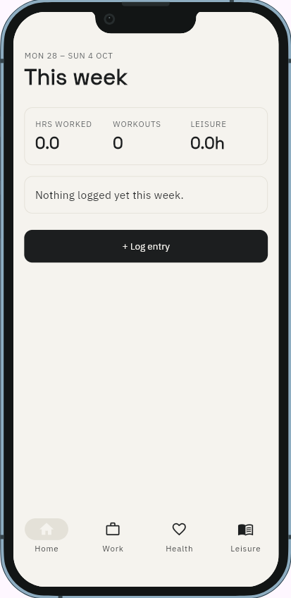
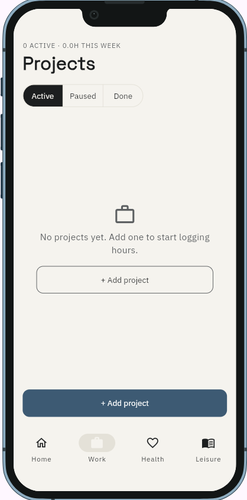
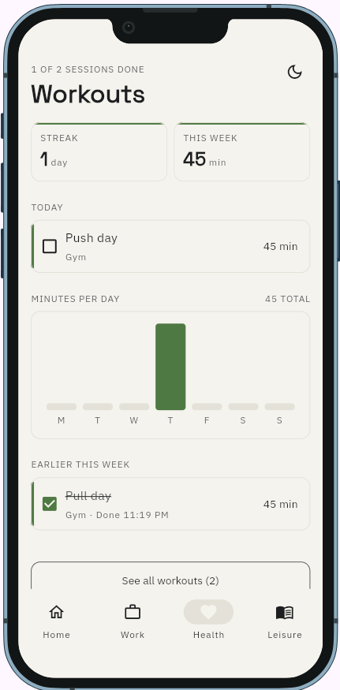
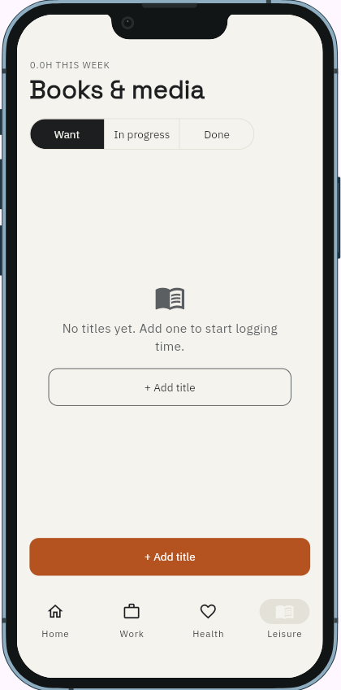
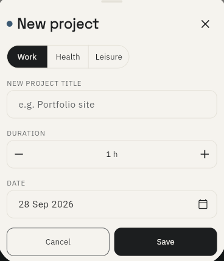

# Trivet


Built with help from Claude (Anthropic). See [AI-USAGE.md](AI-USAGE.md) for how.

## 1. Overview

Trivet is a weekly balance tracker for university students and
early-career workers whose week isn't fixed by an employer, timetable, or
parent. It shows how many hours went into Work, Health, and Leisure this
week, side by side, so a person can see when one pillar is crowding out
the others, without a made-up "balance score" behind it.

Live app: https://keonzane.github.io/Trivet/

## 2. Setup and installation

- Built against Flutter's stable channel, Dart SDK `>=3.3.0 <4.0.0` (see
  `pubspec.yaml`).
- Clone the repository, then from the project root:

  ```
  flutter pub get
  ```

- All of a person's entries are stored locally on the device with
  `shared_preferences` and never sent anywhere.
- The only network use is:
  - **Leisure search.** Typing a title searches Open Library and AniList
    directly (no key needed), and TMDB (films, TV) and RAWG (games)
    through a small Cloudflare Worker in `media_proxy/`. The API keys live
    only in that Worker as Cloudflare secrets. The app only knows the
    Worker's address, which it reads from `dart_defines.json`.
  - **Fonts.** `google_fonts` downloads Space Grotesk and IBM Plex Sans the
    first time the app runs; after that they're cached.
- To run your own proxy instead of mine, see `MEDIA_SEARCH_SETUP.md`, then
  put your Worker's URL in `dart_defines.json` (copy
  `dart_defines.example.json`).

## 3. How to run it

```
flutter run -d chrome --dart-define-from-file=dart_defines.json
```

or, on Windows, `run.bat` (same command). Without the
`--dart-define-from-file` part the app still runs, but film, TV and game
search are switched off; books and anime still work.

In debug mode the app opens inside a phone frame (Device Preview). On
launch you should see four tabs, **Home**, **Work**, **Health** and
**Leisure**, in Design System v2's Paper/Ink colours. The sun/moon button
at the top right switches between light and dark mode.

There are no automated tests yet (`test/` is empty).

The `main` branch is built and published to GitHub Pages automatically by
`.github/workflows/deploy.yml` (see `DEPLOY.md`).

## 4. Features and usage

**Home (Dashboard)** shows the week's date range, the triad chart
comparing the three pillars, a stat card per pillar with this week's
hours, and a one-line nudge naming the thinnest pillar. Below that:
today's workouts (tick them off here), active work projects, and
"Currently enjoying" (titles in progress, plus ones finished this week)
with **SEE ALL** jumping to Leisure. `+ Log entry` opens the Add entry
sheet with a Work / Health / Leisure picker.

**Work** lists projects in one scrolling page with Active / Paused / Done
sections; the bar at the top jumps to a section and follows your
scrolling. Each card shows the due date and hours this week. `+ Add
project` creates a project (title, optional due date, optional first
hours). Tapping a project opens its detail screen: total hours, status,
due date, notes, and `+ Log hours`.

**Health** shows "X of Y sessions done", the current streak and minutes
this week (done sessions only), today's sessions as a checklist, a bar
chart of minutes per day, upcoming sessions and earlier ones this week.
`+ Log workout` adds a Push, Pull, Legs or Cardio session with duration,
date and notes. Ticking a session records when it was done. `See all
workouts` lists every session grouped by date.

**Leisure** lists titles in Want / In progress / Done sections on one
page. `+ Add title` asks for a title and kind (Book, Film, Series, Game);
typing a title shows search results, and picking one fills in the title
and its totals (pages, runtime, seasons and episodes). Tapping a title
opens its detail screen, which changes with the status:

- **Want:** notes.
- **In progress:** current page for books, where you stopped for films,
  season and episode plus where you stopped for series, and time played
  for games. Progress can't go past the totals. Each change is logged as
  leisure time for that day.
- **Done:** a 1–5 star rating and a review, separate from the notes.

Leisure time only counts toward the week once a title is started, so
titles still in Want don't add hours.

Every list supports swipe-left-to-delete, with a confirmation first.

## 5. Project structure

```
lib/
  main.dart                  # start-up, theme switching, the 4-tab shell
  theme.dart                 # Pillar enum, AppSpacing, PillarColors,
                              # light and dark themes, fonts
  models/                    # Project, WorkLog, Workout, MediaEntry,
                              # LeisureLog, MediaResult (a search result)
  services/
    storage_service.dart     # ListStore<T> (shared_preferences),
                              # WeekRange and weekly totals
    theme_controller.dart    # saves light/dark mode
    media_search/            # MediaSearchService + one provider per API
                              # (TMDB, RAWG, Open Library, AniList)
  widgets/                   # shared cards, steppers, fields, charts,
                              # the Add entry sheet, SectionedList
  screens/                   # Dashboard, Work, Health, Leisure, and the
                              # detail and All workouts screens
media_proxy/                 # Cloudflare Worker that holds the API keys
.github/workflows/deploy.yml # builds and publishes the web app
```

State is held per screen with `StatefulWidget` and `setState`, loaded
from and saved back to the matching store. There's no state management
package.

## 6. Screenshots

| Home (Dashboard) | Work |
| --- | --- |
|  |  |

| Health | Leisure |
| --- | --- |
|  |  |

| Add entry sheet |
| --- |
|  |

## 7. Known issues and next steps

- **Leisure time is recorded on the day you update progress**, not the
  day you actually read or watched. Changing progress on Monday for
  something watched on Sunday counts on Monday.
- **The pillar picker only appears when adding from the Dashboard.** From
  Work, Health or Leisure the sheet is already set to that pillar.
- **Tabs reload when you switch to them.** Only the open tab is built, so
  data is always fresh, but a scroll position resets when you leave a tab.
- **Delete is swipe-only**, which is easy to miss if you don't know the
  gesture.
- **The theme button can't go back to "follow the system"** once you've
  picked light or dark.
- **Film, TV and game search depend on the proxy.** If the Worker is down
  or its free limits run out, those searches return nothing; you can
  still type a title by hand.
- **Search results store a poster URL and year**, but no screen shows the
  poster yet.
- **No automated tests yet.**

## AI usage

This project was built with AI assistance. See `AI-USAGE.md` for the
tool, what I asked for, what I kept or changed, and where it went wrong.

## Weekly records

- `REPORT.md`: weekly increment reports.

## Credits

This product uses the TMDB API but is not endorsed or certified by TMDB.
Game data from RAWG (https://rawg.io). Book data from Open Library.
Anime and manga data from AniList.

# Security checklist

## Secrets and credentials

| # | Check | Yes / No / N/A | Evidence |
| --- | --- | --- | --- |
| 1 | No API key, token or password is hardcoded in `lib/`, including in comments and commented-out code | Yes | Searched `lib/` and `pubspec.yaml` for key, secret, password, token and api_key, comments included. The only matches are comments explaining that keys live on the proxy; no key values. The TMDB and RAWG keys exist only as Cloudflare secrets. |
| 2 | Anything private is in a gitignored config or passed with `--dart-define`, with an example file committed | Yes | The API keys are Cloudflare secrets set with `wrangler secret put`, never in the repo. The app only gets the proxy URL, through `--dart-define-from-file=dart_defines.json`; `dart_defines.example.json` is committed. `dart_defines.json` is committed on purpose because the URL is not secret (it is visible in the built web app anyway). Cloudflare account files (`media_proxy/.wrangler/`) are gitignored. |
| 3 | No keystore, `key.properties` or signing credential is in the repository | Yes | No .jks, .keystore, key.properties, .pem or .env file exists. Ran `git ls-files \| Select-String -Pattern "jks\|keystore\|key\.properties\|\.pem\|\.env"`: no matches. [confirm after push] |
| 4 | Git history is clean: I searched `git log -p` for password, secret, api key and token | Yes | Ran `git log -p \| Select-String -Pattern "password\|secret\|api.?key\|token" -CaseSensitive:$false`. Matches are only documentation and code that names the secrets (`TMDB_API_KEY`, `secrets.MEDIA_PROXY_URL`), never a value. [confirm after push] |
| 5 | Any credential that was ever committed has been rotated | N/A | No credential was ever committed (see row 4), so there is nothing to rotate. |

## GitHub Actions

| # | Check | Yes / No / N/A | Evidence |
| --- | --- | --- | --- |
| 6 | No secret value is written literally in any workflow YAML file | Yes | `.github/workflows/deploy.yml` is the only workflow. Its only secret is read as `${{ secrets.MEDIA_PROXY_URL }}`; no values are written in the file. |
| 7 | Secrets are stored in repository Actions secrets and read with `${{ secrets.NAME }}` | Yes | `MEDIA_PROXY_URL` is a repository Actions secret (Settings → Secrets and variables → Actions) and the workflow reads it with `${{ secrets.MEDIA_PROXY_URL }}`. |
| 8 | No workflow step echoes, dumps or debug-prints a secret, and I opened a recent run's log to confirm | Yes | No step uses `echo`, `cat` or debug output on the secret; it is only written into `dart_defines.json` for the build. [confirm: open the latest run's log in the Actions tab and check the URL step shows `***`] |
| 9 | If I build a signed APK: the keystore is a base64 secret decoded to a file at build time, never printed | N/A | The Android job builds an APK with Flutter's default debug signing (`signingConfigs.getByName("debug")` in `android/app/build.gradle.kts`); there is no release keystore. |
| 10 | Uploaded build artifacts contain no key file, keystore or generated config | Yes | The web job uploads `build/web` and the Android job uploads the APK. Neither contains a key or keystore; the only config compiled in is the proxy URL, which is not secret. |
| 11 | Third-party actions are pinned to a commit SHA, not a moveable tag | No | Actions are pinned to version tags (`actions/checkout@v4`, `subosito/flutter-action@v2`, `softprops/action-gh-release@v2` and others), not commit SHAs. Next step: replace each tag with its commit SHA. |
| 12 | Secret scanning and push protection are enabled on the repository | Yes | [confirm: turn on in Settings → Code security → Secret Protection, then check it shows Enabled] |

## Backend and security rules

The app has no database or accounts: all user data is stored on the
device with `shared_preferences`. The only server is the Cloudflare
Worker, which stores nothing and only forwards searches. Rows 13–17 are
therefore N/A.

| # | Check | Yes / No / N/A | Evidence |
| --- | --- | --- | --- |
| 13 | Firestore and Storage rules are not left open to anyone; they require an authenticated user | N/A | No Firebase or Supabase is used, so there are no rules to write (covers rows 13–17). |
| 14 | Rules restrict a user to their own documents where that makes sense | N/A | No backend database and no accounts (see row 13). |
| 15 | If Supabase: Row Level Security is on for every table | N/A | Supabase is not used (see row 13). |
| 16 | Firebase and Google API keys are restricted in the Google Cloud console to the APIs and app they are for | N/A | The app uses no Firebase or Google API keys (see row 13). The TMDB and RAWG keys never leave the proxy. |
| 17 | I opened the app signed out and confirmed I could not read or write data I should not | N/A | There is no sign-in and no shared data: each install only holds its own entries (see row 13). |
| 18 | Seed and sample data is invented, not real people's data | N/A | The app has no seed or sample data. |

## Input and app surface

| # | Check | Yes / No / N/A | Evidence |
| --- | --- | --- | --- |
| 19 | Input is validated before it is written, not only styled as valid in the UI | Yes | `_save()` in `add_entry_sheet.dart` checks the trimmed title is not empty before a project or title is created. Durations and progress only change through `NumberStepper`, which clamps to its min and max, so progress can't pass a title's totals. The proxy only accepts search paths, cuts each parameter to 200 characters and caps RAWG results at 20. Not checked: title and notes length. |
| 20 | Nothing secret is recoverable from the built app, since a shipped binary can be unpacked | Yes | The built app contains only the proxy URL, which is not secret. The API keys stay in Cloudflare and are added to requests on the proxy's side. |

## Repository and privacy

| # | Check | Yes / No / N/A | Evidence |
| --- | --- | --- | --- |
| 21 | No student number, personal email, phone number or home address in the repository or in commit messages | Yes | Commit author is the GitHub noreply address (checked with `git log --format="%an %ae %s"`). `android/local.properties` (local paths) and `media_proxy/.wrangler/` (Cloudflare account) are gitignored. [confirm after push] |
| 22 | No classmate's personal data in the repository | Yes | The app only stores the person's own entries and the project contains no data about anyone else. |
| 23 | Dependencies come from pub.dev, and `build/` and `.dart_tool/` are gitignored | Yes | Runtime dependencies are google_fonts, shared_preferences, http, url_launcher and device_preview, all from pub.dev. `.gitignore` lists `.dart_tool/` and `build/`. |
| 24 | Images, fonts and other assets are mine, licensed, or credited | Yes | Fonts are Space Grotesk and IBM Plex Sans (SIL OFL) via `google_fonts`. Search data comes from TMDB, RAWG, Open Library and AniList, credited in the README's Credits section; RAWG is also credited in the app with the link its terms require. Screenshots are my own captures. |
| 25 | Repository visibility is deliberate, and I checked it after my last push | Yes | Public, so the instructor can view it. [confirm: open the repo in a private window after the final push and check no `.dart_tool`, `build`, `.wrangler` or `local.properties` is visible] |

## Anything I found and fixed

Filling this in caught several things. The README said the app was fully
offline, but `google_fonts` downloads the fonts on first launch, so I
corrected it. A corrupted stored record used to leave a screen stuck on
its loading spinner; `ListStore.load()` now skips bad records. Adding
media search meant handling API keys: instead of putting them in the app,
they live as Cloudflare secrets in a proxy, and I removed the unused IGDB
code that would have needed a Twitch client secret. An old GitHub
secret-scanning alert was a false positive from a committed `.dart_tool`
browser profile; `.dart_tool/` is now gitignored. One item is still open:
workflow actions are pinned to tags, not commit SHAs (row 11).